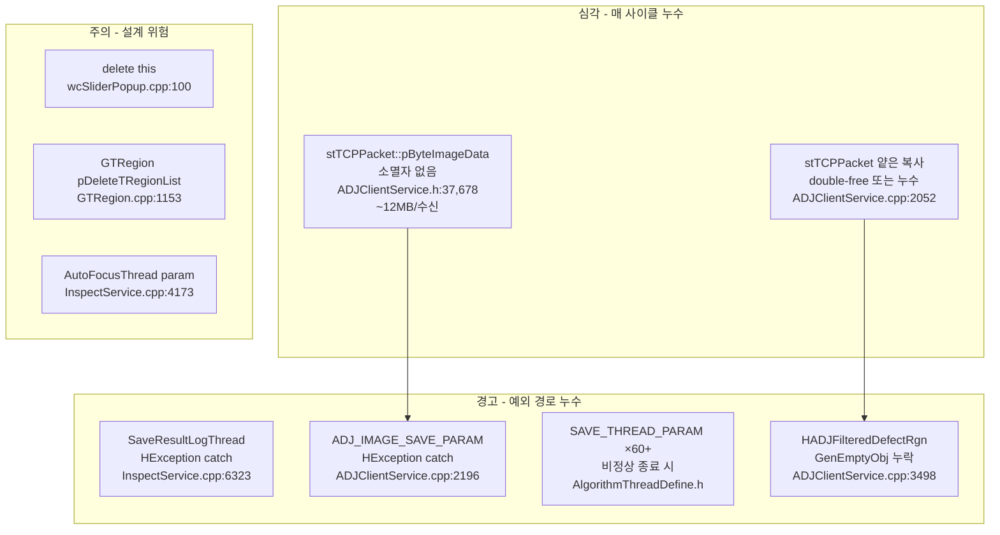

# 메모리 누수 분석 보고서

> 작성일: 2026-03-06
> 대상 프로젝트: Universal_AVI (uScan)
> 분석 도구: 코드 정적 분석 (Grep, Read)

---

## 1. 분석 요약

| 위험도 | 건수 | 설명 |
|:---:|:---:|---|
| **심각 (Critical)** | 2 | 매 검사 사이클마다 반복 누수 |
| **경고 (Warning)** | 4 | 예외 경로 또는 조건부 누수 |
| **주의 (Info)** | 3 | 설계상 잠재적 위험 패턴 |

---

## 2. 심각 (Critical) — 반복 누수

### [C-1] `stTCPPacket::pByteImageData` — 소멸자 없음으로 인한 반복 누수

**파일**: `ADJClientService.h:37, 678`

**현상**:
```cpp
// ADJClientService.h:37 — 포인터 멤버 선언
struct stTCPPacket {
    BYTE* pByteImageData;  // 힙 할당 포인터

    stTCPPacket() {
        pByteImageData = nullptr;  // 생성자에서 nullptr 초기화만
        // ... 소멸자 없음 → 할당된 메모리 절대 해제 안 됨
    }
    // ~stTCPPacket() 없음
};

// ADJClientService.h:678 — ParseMessage() 내부에서 할당
this->pByteImageData = new BYTE[imageDataSize];  // 세그먼트 이미지 수신 시
```

**누수 경로**:
```
ParseMessage()
  → pByteImageData = new BYTE[imageDataSize]  ← 할당
  → return RECV_INSPECT_SEGMENT_RESULT
  → tcpPacket 복사: stADJdata->tcpPacket = tcpPacket[iClientNO]  ← 얕은 복사
  → SAFE_DELETE(newADJdata)  ← stADJNetworkData 해제, pByteImageData는 미해제
```

**영향**:
- ADJ 세그먼트 검사 응답 수신 1회마다 `imageWidth × imageHeight × 3` bytes 누수
- 2048×2048 이미지 기준 **~12MB/수신** 누수
- 장시간 운영 시 OutOfMemoryError 발생 위험

**근본 원인**: `stTCPPacket`에 소멸자가 없고, 복사 연산자도 없어 얕은 복사 후 이중 소유 문제 발생

**수정 방법**:
```cpp
// stTCPPacket에 소멸자 + 복사 금지 추가
~stTCPPacket() {
    delete[] pByteImageData;
    pByteImageData = nullptr;
}
// 복사 방지 (얕은 복사로 인한 double-free 차단)
stTCPPacket(const stTCPPacket&) = delete;
stTCPPacket& operator=(const stTCPPacket&) = delete;
stTCPPacket(stTCPPacket&&) = default;             // 이동만 허용
stTCPPacket& operator=(stTCPPacket&&) = default;
```

---

### [C-2] `stTCPPacket` 얕은 복사 — double-free 또는 누수 동시 위험

**파일**: `ADJClientService.cpp:2052`

**현상**:
```cpp
// ADJClientService.cpp:2051~2052
stADJNetworkData *stADJdata = new stADJNetworkData();
stADJdata->tcpPacket = tcpPacket[iClientNO];  // ← pByteImageData 포인터 얕은 복사
```

`stTCPPacket`이 값 타입으로 복사될 때 `pByteImageData` 포인터만 복사됨:

```
tcpPacket[iClientNO].pByteImageData → [메모리 블록 A]
stADJdata->tcpPacket.pByteImageData → [메모리 블록 A]  ← 동일 주소
```

- **시나리오 1**: `stADJdata` SAFE_DELETE 시 `stADJNetworkData` 구조체만 해제, `pByteImageData`는 미해제 → **누수**
- **시나리오 2**: `tcpPacket[iClientNO]` 재사용 시 원래 포인터 덮어쓰기, `stADJdata->tcpPacket.pByteImageData`는 dangling pointer → **use-after-free** 위험

**수정 방법**:
```cpp
// stADJNetworkData가 이미지 데이터를 소유하도록 변경
// pByteImageData를 std::vector<BYTE>로 교체하여 자동 관리
struct stTCPPacket {
    std::vector<BYTE> imageData;  // BYTE* pByteImageData 대신
    // ... 소멸자/복사 연산자 자동 생성됨
};
```

---

## 3. 경고 (Warning) — 조건부/예외 경로 누수

### [W-1] `SaveResultLogThread` — HException catch 블록 내 누수

**파일**: `InspectService.cpp:6236~6340`

**현상**:
```cpp
UINT SaveResultLogThread(LPVOID lp) {
    try {
        while (TRUE) {
            RESULT_LOG_SAVE_PARAM* pSaveThreadParam = pInspectService->GetNextSaveResultLogParam(iMzNo);
            // ... 로그 저장 작업 ...
            delete pSaveThreadParam;  // ← 정상 경로: 올바르게 해제
        }
    }
    catch (HException &except) {
        // ← pSaveThreadParam이 큐에서 꺼낸 상태에서 예외 발생 시
        // ← delete 없이 return → 누수
        // ← 큐에 남아있는 나머지 RESULT_LOG_SAVE_PARAM 항목들도 해제 안 됨
        pInspectService->m_bSaveResultLogThreadDone[iMzNo - 1] = TRUE;
        return 0;
    }
}
```

**누수량**: HALCON 예외 발생 시 큐에 남은 `RESULT_LOG_SAVE_PARAM` 객체 전체

**수정 방법**:
```cpp
catch (HException &except) {
    // 현재 처리 중인 파라미터 해제
    if (pSaveThreadParam) {
        delete pSaveThreadParam;
        pSaveThreadParam = nullptr;
    }
    // 큐에 남은 항목 모두 비우기
    while (!pInspectService->IsSaveResultLogParamEmpty(iMzNo)) {
        auto* p = pInspectService->GetNextSaveResultLogParam(iMzNo);
        delete p;
    }
    // ...
}
```

---

### [W-2] `ADJClientService` — HException catch 블록 내 `ADJ_IMAGE_SAVE_PARAM` 누수

**파일**: `ADJClientService.cpp:2160~2220`

**현상**:
```cpp
// 정상 경로
ADJ_IMAGE_SAVE_PARAM* pSaveThreadIDParam = new ADJ_IMAGE_SAVE_PARAM;
THEAPP.m_pInspectService->AddListSaveADJImageParam(pSaveThreadIDParam, ...);  // 큐에 push

// ← HException catch 블록에 도달하면 이미 큐에 push된 상태
// ← catch 블록에서 큐 미비우기 → 누수
catch (HException &except) {
    // HALCON ConcatimageObj 처리 중 예외 발생 시
    // pSaveThreadIDParam은 이미 큐에 들어간 상태이거나
    // new 후 AddList 전에 예외 발생 시 orphan 상태
}
```

**영향**: ADJ 이미지 저장 파라미터 (HObject `HSaveImage` 포함) 미해제 → HALCON 오브젝트 + 힙 동시 누수

---

### [W-3] `AlgorithmThreadDefine.h` — `SAVE_THREAD_PARAM` / `RESULT_LOG_SAVE_PARAM` 스레드 파라미터 누수

**파일**: `AlgorithmThreadDefine.h:10130, 15971`

**현상**:
```cpp
// AlgorithmThreadDefine.h:10130
SAVE_THREAD_PARAM* pSaveThreadIDParam = new SAVE_THREAD_PARAM(...);
AfxBeginThread(SaveImageThread, pSaveThreadIDParam, THREAD_PRIORITY_HIGHEST);
// ← 스레드 함수 내부에서 delete해야 하는 패턴
// ← 스레드가 비정상 종료 시 또는 delete 누락 시 누수
```

`AlgorithmThreadDefine.h` 전체에 걸쳐 `RESULT_LOG_SAVE_PARAM`을 `new`로 생성 후 큐에 push하는 패턴이 **60회 이상** 반복됨. 큐가 정상적으로 소비되지 않는 예외 상황에서 모두 누수됨.

**영향 파일**: `AlgorithmThreadDefine.h`, `ADJClientService.cpp` — 각 검사 사이클마다 다수의 `RESULT_LOG_SAVE_PARAM` 생성

---

### [W-4] `ADJ_IMAGE_SAVE_PARAM` / `REVIEW_IMAGE_SAVE_PARAM` — HObject 미해제

**파일**: `ADJClientService.h:736~`

**현상**:
```cpp
typedef struct _stADJNetworkData {
    stTCPPacket tcpPacket;          // pByteImageData 소유 (C-1 참조)
    HObject ConcatimageObj;          // HALCON 오브젝트 — ref count 기반
    HObject HADJSaveRegion;          // HALCON 오브젝트
    HObject *HADJFilteredDefectRgn;  // 외부 포인터 — 소유권 불명확
    // ...
} stADJNetworkData;
```

`SAFE_DELETE(newADJdata)` 전에 `GenEmptyObj(&newADJdata->ConcatimageObj)`를 명시적으로 호출하는 코드 패턴을 발견:
```cpp
// ADJClientService.cpp:3473~3474 — 정상 경로
GenEmptyObj(&newADJdata->ConcatimageObj);  // HALCON ref 해제
SAFE_DELETE(newADJdata);
```

그러나 `result != 0` 경로의 내부 루프(`3482~3499`)에서 큐 비우기 시:
```cpp
while (!ADJClientService->m_qADJBuffer[...].IsEmpty()) {
    newADJdata = ...->next();
    GenEmptyObj(&newADJdata->HADJSaveRegion);
    GenEmptyObj(&newADJdata->ConcatimageObj);
    SAFE_DELETE(newADJdata);
    // ← HADJFilteredDefectRgn 포인터는 GenEmptyObj 호출 없음
}
```

`HADJFilteredDefectRgn`(외부 배열 포인터)에 대한 HALCON 오브젝트 해제 처리가 누락됨.

---

## 4. 주의 (Info) — 설계상 잠재적 위험

### [I-1] `wcSliderPopup::OnKillFocus` — `delete this` 패턴

**파일**: `wcSliderPopup.cpp:100`

```cpp
void wcSliderPopup::OnKillFocus(CWnd* pNewWnd) {
    // ...
    delete this;  // ← 자기 자신을 delete
}
```

**위험**: `delete this` 후 멤버 변수나 가상 함수 테이블에 접근하면 use-after-free. MFC 윈도우 객체에서 이 패턴은 `DestroyWindow()` 후 `PostNcDestroy()` 오버라이드에서 사용하는 정형적 패턴과 다름. 현재 코드에서 `delete this` 이후 스택에 남은 코드가 실행되는지 확인 필요.

---

### [I-2] `GTRegion` — `pDeleteTRegionList` 조건부 미해제

**파일**: `GTRegion.cpp:1153`

```cpp
PList<GTRegion> *pDeleteTRegionList = new PList<GTRegion>(PLNO_POINTER);
// ... 사용 후
// delete pDeleteTRegionList;  ← 이 줄이 항상 실행되는지 확인 필요
```

`PList` 소멸 시 내부 GTRegion 포인터도 함께 해제되는지 `PLNO_POINTER` 플래그 의미 확인 필요.

---

### [I-3] `InspectService.cpp` — `AutoFocusThread` 파라미터 누수 가능성

**파일**: `InspectService.cpp:4173, 5004`

```cpp
// InspectService.cpp:4173
AfxBeginThread(AutoFocusThread, LPVOID(pModulePosParam));
// ← pModulePosParam이 new로 생성되었다면 스레드 내부에서 delete 필요
// ← 스레드 강제 종료 시 누수
```

스레드 함수 시작 시 파라미터를 캐스팅 후 즉시 `SAFE_DELETE`하는 패턴이 있지만, 스레드가 예외로 종료되는 경우 처리 여부 확인 필요.

---

## 5. 정상 처리 확인 목록

다음 패턴은 코드 분석 결과 올바르게 처리되고 있음:

| 항목 | 파일 | 처리 방식 |
|---|---|---|
| `mp_TcpHandler[]` (CClientSocket) | `HandlerService.cpp:118, 174` | 소멸자에서 `delete` |
| `RESULT_LOG_SAVE_PARAM` (정상 경로) | `InspectService.cpp:6306` | `SaveResultLogThread` 내 `delete pSaveThreadParam` |
| `stADJNetworkData` (정상 경로) | `ADJClientService.cpp:3474, 3480, 3506` | `SAFE_DELETE(newADJdata)` |
| `CHandlerService 싱글턴` | `HandlerService.cpp:32` | 종료 시 명시적 해제 패턴 |
| `AlgorithmOCRDlg HObject[]` | `AlgorithmOCRDlg.cpp:489~` | 소멸자에서 `delete[]` |
| `Algorithm 싱글턴 내 m_pSemaphore` | `Algorithm.cpp:156` | `SAFE_DELETE` |
| `BatchGrabThread pParam` | `BatchGrabThread.h:108, 262, 312` | `delete pParam` |

---

## 6. 종합 위험도 맵



---

## 7. 수정 우선순위 및 권장 조치

| 순위 | ID | 파일 | 수정 방법 | 난이도 |
|:---:|---|---|---|:---:|
| 1 | C-1 | `ADJClientService.h` | `stTCPPacket` 소멸자 추가 + `pByteImageData` → `std::vector<BYTE>` 교체 | ★★☆ |
| 2 | C-2 | `ADJClientService.cpp` | `stTCPPacket` 이동 의미론 적용 (copy 금지) | ★★☆ |
| 3 | W-1 | `InspectService.cpp` | catch 블록에서 `pSaveThreadParam` delete + 큐 비우기 | ★☆☆ |
| 4 | W-2 | `ADJClientService.cpp` | catch 블록에서 큐 항목 전체 해제 | ★☆☆ |
| 5 | W-4 | `ADJClientService.cpp` | `HADJFilteredDefectRgn` GenEmptyObj 누락 구간 보완 | ★☆☆ |
| 6 | W-3 | `AlgorithmThreadDefine.h` | 스레드 함수 catch 블록에서 파라미터 해제 보장 | ★★★ |
| 7 | I-1 | `wcSliderPopup.cpp` | `delete this` → MFC `PostNcDestroy` 패턴으로 전환 | ★★☆ |

---

## 8. 정적 분석 도구 도입 권장

현재 프로젝트에는 자동화된 테스트/분석 인프라가 없음. 아래 도구로 런타임 메모리 누수를 추가 확인 권장:

| 도구 | 용도 | 적용 방법 |
|---|---|---|
| **Visual Studio Diagnostic Tools** | 런타임 힙 스냅샷 비교 | Debug 모드 > 진단 도구 > 메모리 사용량 탭 |
| **_CrtDumpMemoryLeaks()** | 프로그램 종료 시 누수 목록 출력 | `OnExitInstance()`에 한 줄 추가 |
| **Application Verifier** | 힙 손상, use-after-free 감지 | Windows SDK 포함, 별도 설치 불필요 |
| **AddressSanitizer (ASAN)** | MSVC 2019+ 지원, 런타임 메모리 오류 감지 | `/fsanitize=address` 컴파일 옵션 |

```cpp
// 간단한 누수 감지 추가 방법 (CuScanApp::ExitInstance 마지막 줄)
#ifdef _DEBUG
_CrtDumpMemoryLeaks();
#endif
```
