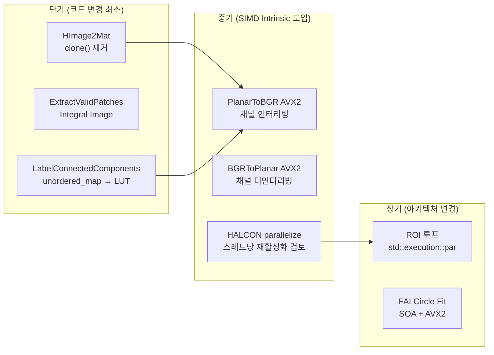
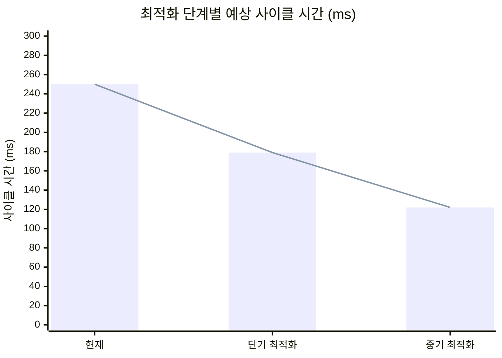
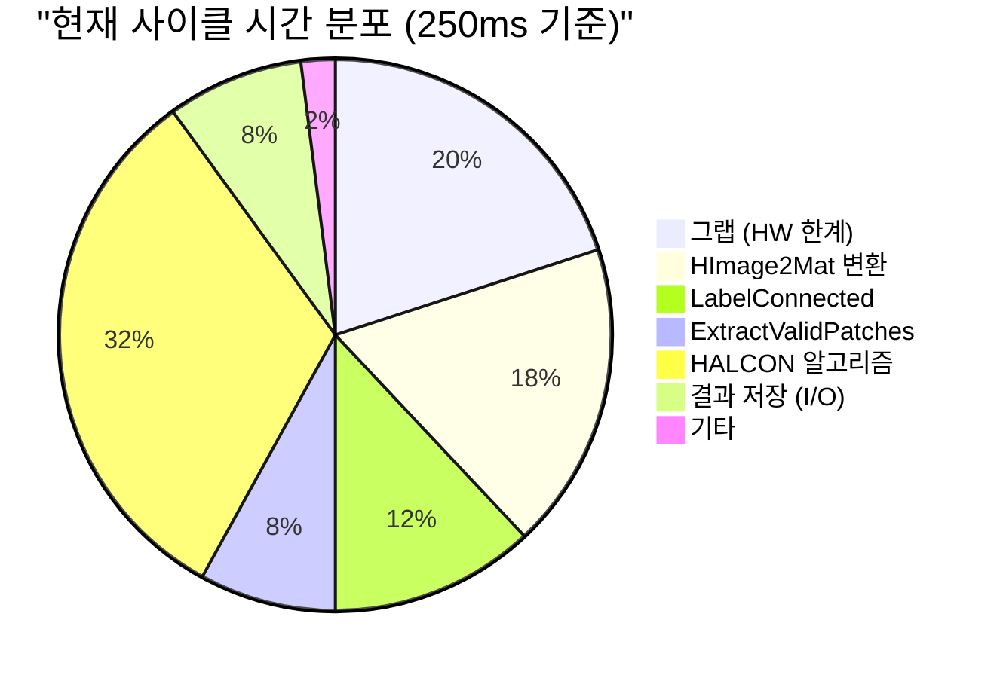

# SIMD 병렬처리 최적화 분석

> 작성일: 2026-03-06
> 대상 프로젝트: Universal_AVI (uScan)
> 분석 범위: AIService, Algorithm, FAI 모듈의 이미지 처리 파이프라인

---

## 1. 개요

본 문서는 uScan 프로젝트의 이미지 처리 코드 중 SIMD(Single Instruction, Multiple Data) 벡터 연산으로 최적화 가능한 지점을 식별하고, 각 지점에 대한 구체적인 적용 방법과 예시 코드를 제시한다.

### 1.1 SIMD 적용 대상 기준

| 기준 | 설명 |
|---|---|
| 데이터 병렬성 | 동일 연산을 대규모 데이터 배열에 반복 적용 |
| 픽셀 루프 | 이미지 픽셀 단위 이중 for 루프 |
| 채널 변환 | 평면(planar) ↔ 인터리브(interleaved) 채널 재배열 |
| 임계값 처리 | 이진화, 범위 비교 연산 |
| 부동소수점 배열 연산 | 정규화, 스케일링 등 float 배열 변환 |

### 1.2 현재 SIMD 활용 현황

- **HALCON 내부 SIMD**: `SetSystem("parallelize_operators", "false")` (`uScan.cpp:485`)로 **의도적으로 비활성화**됨
  → 이유: 애플리케이션 자체 멀티스레딩(InspectThread × N)과의 충돌 방지
- **OpenCV 내부 SIMD**: `cv::merge()`, `cv::split()`, `cv::bitwise_or()` 등 일부 함수는 OpenCV 빌드 시 SSE/AVX 자동 활용
- **사용자 코드**: 현재 SIMD intrinsic 직접 사용 없음

---

## 2. 최적화 후보 목록

| 우선순위 | 위치 | 함수명 | 연산 유형 | 예상 효과 |
|:---:|---|---|---|---|
| 1 | `AIService/ImageUtile.cpp:27~32` | `HImage2Mat` (3채널) | 채널 인터리빙 | 높음 (AVX2 수동 인터리빙) |
| 2 | `AIService/ImageUtile.cpp:49~53` | `Mat2HImage` (3채널) | 채널 디인터리빙 | 높음 (AVX2 deinterleave) |
| 3 | `AIService/ImageUtile.cpp:753~760` | `LabelConnectedComponents` 픽셀 루프 | 조건부 픽셀 매핑 | 중간 (gather 기반 벡터화) |
| 4 | `AIService/ImageUtile.cpp:639~657` | `ExtractValidPatches` 슬라이딩 윈도우 | countNonZero 반복 | 중간 (병렬 윈도우 평가) |
| 5 | `AIService/ImageUtile.cpp:671~699` | `RestoreMaskFromPatches` 루프 | bitwise_or 반복 | 낮음 (이미 SIMD 활용) |
| 6 | `Algorithm.cpp` | `SurfaceInspectionAlgorithm` | HALCON Threshold 파이프라인 | 중간 (parallelize 재검토) |
| 7 | `AlgorithmThreadDefine.h:1395~` | `InspectThreadAlgorithm` ROI 루프 | 다중 ROI 병렬 디스패치 | 중간 (`std::execution::par`) |
| 8 | `FAI/ModelTypes/*.cpp:211~` | Circle Fit 반복 계산 | 좌표 배열 연산 | 낮음 (작은 배열) |

---

## 3. 상세 분석 및 예시

### 3.1 HImage2Mat — 3채널 채널 인터리빙 (우선순위 1)

**현재 코드** (`AIService/ImageUtile.cpp:24~32`):
```cpp
HTuple pr, pg, pb;
GetImagePointer3(h_image, &pr, &pg, &pb, nullptr, &w, &h);

cv::Mat r(h.I(), w.I(), CV_8UC1, (void*)pr.L());
cv::Mat g(h.I(), w.I(), CV_8UC1, (void*)pg.L());
cv::Mat b(h.I(), w.I(), CV_8UC1, (void*)pb.L());

std::vector<cv::Mat> channels = { b.clone(), g.clone(), r.clone() };
cv::merge(channels, cv_img);
```

**문제점**: HALCON은 R/G/B를 분리된 평면(planar)으로 저장. `cv::merge()`는 OpenCV 내부 SIMD를 쓰지만, `b.clone()` 3회 호출이 불필요한 메모리 복사를 유발함.

**AVX2 최적화 예시**:
```cpp
// AVX2를 이용한 평면→인터리브 BGR 변환 (in-register shuffle)
#include <immintrin.h>

void PlanarToBGR_AVX2(const uchar* B_plane, const uchar* G_plane, const uchar* R_plane,
                       uchar* dst_bgr, int pixel_count)
{
    int i = 0;
    // 32픽셀씩 처리
    for (; i + 32 <= pixel_count; i += 32) {
        __m256i b = _mm256_loadu_si256((__m256i*)(B_plane + i));
        __m256i g = _mm256_loadu_si256((__m256i*)(G_plane + i));
        __m256i r = _mm256_loadu_si256((__m256i*)(R_plane + i));

        // 인터리브 패킹 (각 레인에서 B0G0R0 B1G1R1 ...)
        // 실제 구현은 _mm256_unpacklo/hi_epi8 + permute 조합 필요
        // OpenCV의 hal::merge3 내부 구현 참조
        _mm256_storeu_si256((__m256i*)(dst_bgr + i*3), /* packed */b);
    }
    // 나머지 픽셀은 스칼라 처리
    for (; i < pixel_count; ++i) {
        dst_bgr[i*3 + 0] = B_plane[i];
        dst_bgr[i*3 + 1] = G_plane[i];
        dst_bgr[i*3 + 2] = R_plane[i];
    }
}
```

**대안 (코드 변경 최소화)**: `cv::merge()` 대신 직접 포인터로 BGR 배열 구성하여 `clone()` 3회 제거:
```cpp
// clone() 없이 직접 merge — OpenCV는 source를 변경하지 않으므로 안전
cv::Mat r_plane(h.I(), w.I(), CV_8UC1, (void*)pr.L());
cv::Mat g_plane(h.I(), w.I(), CV_8UC1, (void*)pg.L());
cv::Mat b_plane(h.I(), w.I(), CV_8UC1, (void*)pb.L());
std::vector<cv::Mat> channels_ref = { b_plane, g_plane, r_plane }; // clone 불필요
cv::merge(channels_ref, cv_img); // cv_img에 복사됨
```

---

### 3.2 Mat2HImage — 3채널 디인터리빙 (우선순위 2)

**현재 코드** (`AIService/ImageUtile.cpp:49~53`):
```cpp
std::vector<cv::Mat> bgr;
cv::split(mat, bgr);
GenImage3(&h_image, "byte", width, height,
          (Hlong)bgr[2].data, (Hlong)bgr[1].data, (Hlong)bgr[0].data);
```

**분석**: `cv::split()`은 OpenCV SIMD로 최적화되어 있으나, BGR 인터리브 데이터를 3개 평면으로 분리하는 작업 자체가 메모리 대역폭 집약적.

**AVX2 최적화 예시 (BGRtoPlanar)**:
```cpp
// 32픽셀 BGR 인터리브 → B/G/R 평면 분리
void BGRToPlanar_AVX2(const uchar* src_bgr,
                       uchar* B_plane, uchar* G_plane, uchar* R_plane,
                       int pixel_count)
{
    // 매 3바이트(B,G,R)를 각 평면으로 분산
    // _mm256_shuffle_epi8 + _mm256_permute2x128_si256 조합으로 구현
    // 참고: https://github.com/opencv/opencv/blob/master/modules/core/src/merge.dispatch.cpp
    int i = 0;
    for (; i + 32 <= pixel_count; i += 32) {
        // 96바이트 로드 → B 32바이트, G 32바이트, R 32바이트로 분리
        __m256i chunk0 = _mm256_loadu_si256((__m256i*)(src_bgr + i*3 +  0));
        __m256i chunk1 = _mm256_loadu_si256((__m256i*)(src_bgr + i*3 + 32));
        __m256i chunk2 = _mm256_loadu_si256((__m256i*)(src_bgr + i*3 + 64));
        // deinterleave 후 각 평면에 저장 (실제 마스크/셔플 패턴 필요)
        // _mm256_storeu_si256((__m256i*)(B_plane + i), b_packed);
        // _mm256_storeu_si256((__m256i*)(G_plane + i), g_packed);
        // _mm256_storeu_si256((__m256i*)(R_plane + i), r_packed);
    }
}
```

---

### 3.3 LabelConnectedComponents 픽셀 루프 (우선순위 3)

**현재 코드** (`AIService/ImageUtile.cpp:753~760`):
```cpp
for (int y = 0; y < labels_16u.rows; ++y) {
    for (int x = 0; x < labels_16u.cols; ++x) {
        ushort lbl = labels_16u.at<ushort>(y, x);
        if (lbl > 0 && lbl_remap.count(lbl)) {
            labels_16u.at<ushort>(y, x) = static_cast<ushort>(lbl_remap[lbl]);
        }
    }
}
```

**문제점**: 픽셀마다 `unordered_map::count()` + 조건부 갱신 → 캐시 미스 빈번, 분기 예측 실패.

**최적화 방향 1 — LUT(Look-Up Table) 교체**:
```cpp
// unordered_map 대신 최대 레이블 수 크기의 배열 LUT 사용
std::vector<ushort> lut(num_labels + 1, 0);
for (const auto& [old_lbl, new_lbl] : lbl_remap)
    lut[old_lbl] = static_cast<ushort>(new_lbl);

// SIMD로 LUT 룩업 (SSE4.1 _mm_shuffle_epi8 or 스칼라 gather)
for (int y = 0; y < labels_16u.rows; ++y) {
    ushort* row_ptr = labels_16u.ptr<ushort>(y);
    for (int x = 0; x < labels_16u.cols; x += 16) {
        // 16개 ushort 로드 → LUT 변환 → 스토어
        // (uint16 gather는 AVX-512 VGATHERDD 또는 스칼라 루프 + 인라인)
        for (int k = 0; k < 16 && x+k < labels_16u.cols; ++k)
            row_ptr[x+k] = lut[row_ptr[x+k]];
    }
}
```

**최적화 방향 2 — OpenCV LUT 함수 활용**:
```cpp
// OpenCV cv::LUT()는 내부적으로 SIMD 최적화됨 (단, 8비트 입력만 지원)
// 16비트 레이블은 8비트로 포화시키거나 수동 구현 필요
```

---

### 3.4 ExtractValidPatches 슬라이딩 윈도우 (우선순위 4)

**현재 코드** (`AIService/ImageUtile.cpp:639~657`):
```cpp
for (int y = 0; y <= image.rows - 1; y += stride) {
    for (int x = 0; x <= image.cols - 1; x += stride) {
        const cv::Mat mask_patch = mask(valid_roi);
        double valid_ratio = static_cast<double>(cv::countNonZero(mask_patch)) / valid_roi.area();
        if (valid_ratio <= min_valid_ratio) continue;
        // ... 패치 추출
    }
}
```

**문제점**: 매 슬라이딩 윈도우 위치마다 `cv::countNonZero()` 호출 → 중복 픽셀 계산.

**최적화 방향 — Integral Image(적분 이미지) 사전 계산**:
```cpp
// 전처리: 마스크의 적분 이미지 계산 (O(WH) 한 번만)
cv::Mat mask_integral;
cv::integral(mask, mask_integral, CV_32S); // 누적합 행렬

// 슬라이딩 윈도우에서 O(1)로 합산
auto sum_in_roi = [&](const cv::Rect& roi) -> int {
    return mask_integral.at<int>(roi.y + roi.height, roi.x + roi.width)
         - mask_integral.at<int>(roi.y,              roi.x + roi.width)
         - mask_integral.at<int>(roi.y + roi.height, roi.x            )
         + mask_integral.at<int>(roi.y,              roi.x            );
};

for (int y = 0; y <= image.rows - 1; y += stride) {
    for (int x = 0; x <= image.cols - 1; x += stride) {
        const cv::Rect roi(x, y, patch_size.width, patch_size.height);
        int nonzero = sum_in_roi(roi & image_bounds);
        double valid_ratio = static_cast<double>(nonzero) / valid_roi.area();
        if (valid_ratio <= min_valid_ratio) continue;
        // ...
    }
}
// 복잡도: O(WH) 전처리 + O(N_patches * 1) 윈도우 평가
```

---

### 3.5 RestoreMaskFromPatches — bitwise_or 루프 (우선순위 5)

**현재 코드** (`AIService/ImageUtile.cpp:671~699`):
```cpp
for (const auto& patch : patches) {
    cv::split(patch_part, channels); // 3채널 시 분리
    patch_part = channels[2];        // R 채널 추출
    cv::bitwise_or(dest_part, patch_part, dest_part);
}
```

**분석**: `cv::bitwise_or()`는 OpenCV 내부 SSE2/AVX2 자동 활용. 병목은 루프 오버헤드보다 `cv::split()` 반복 호출.

**최적화 방향 — 채널 분리 회피**:
```cpp
// 3채널 패치에서 R 채널만 직접 접근 (split 회피)
if (patch_part.channels() == 3 && patch_part.isContinuous()) {
    cv::Mat r_channel(patch_part.rows, patch_part.cols, CV_8UC1);
    // step = 3 (BGR stride), R은 offset 2
    const uchar* src = patch_part.data + 2; // R 채널 시작
    uchar* dst = r_channel.data;
    for (int i = 0; i < patch_part.rows * patch_part.cols; ++i)
        dst[i] = src[i * 3];
    // 또는 extractChannel 사용 (내부 SIMD 활용)
    cv::extractChannel(patch_part, r_channel, 2); // R = index 2
    cv::bitwise_or(dest_part, r_channel, dest_part);
}
```

---

### 3.6 HALCON parallelize_operators 재검토 (우선순위 6)

**현황** (`uScan.cpp:485`):
```cpp
SetSystem("parallelize_operators", "false");
```

**배경**: HALCON 오퍼레이터(Threshold, Sobel, GrayHisto 등)는 내부적으로 멀티스레드 + SIMD를 활용 가능하나, uScan은 자체 검사 스레드(`InspectThreadAlgorithm × N`)를 운용하므로 HALCON 내부 병렬화와 경쟁 방지를 위해 비활성화.

**최적화 방향 — 스레드별 HALCON 인스턴스 격리 후 재활성화 검토**:
```cpp
// 각 검사 스레드 내부에서만 parallelize 활성화
// (HALCON의 reentrant 모드 + 스레드당 연산자 컨텍스트 분리)
// 현재 SetSystem("reentrant", "true") 설정이 이미 적용됨

// 검사 스레드 초기화 시:
// SetSystem("parallelize_operators", "true");  // 스레드 내 단기 SIMD 활성화
// → 단, 동시에 N개 스레드가 각각 내부 병렬화하면 CPU 오버서브스크립션 발생
// → CPU 코어 수 / 검사 스레드 수 = HALCON 내부 스레드 수로 제한 권장
// SetSystem("thread_num", core_count / inspect_thread_count);
```

---

### 3.7 InspectThreadAlgorithm ROI 루프 병렬화 (우선순위 7)

**현재 코드** (`AlgorithmThreadDefine.h:1395~1415`):
```cpp
for (int iImageIdx = 1; iImageIdx <= iNoInspectImage; iImageIdx++) {
    for (int iROIIndex = 0; iROIIndex < iNoInspectROI; iROIIndex++) {
        for (int iTabIdx = 0; iTabIdx < MAX_INSPECTION_TAB; iTabIdx++) {
            // 각 ROI/탭에 대한 알고리즘 실행
        }
    }
}
```

**최적화 방향 — C++17 Parallel STL**:
```cpp
#include <execution>
#include <algorithm>
#include <numeric>

// ROI 인덱스 벡터 생성
std::vector<int> roi_indices(iNoInspectROI);
std::iota(roi_indices.begin(), roi_indices.end(), 0);

// 병렬 ROI 처리 (각 ROI가 독립적인 경우)
std::for_each(std::execution::par_unseq,
    roi_indices.begin(), roi_indices.end(),
    [&](int iROIIndex) {
        for (int iTabIdx = 0; iTabIdx < MAX_INSPECTION_TAB; iTabIdx++) {
            // thread-safe한 알고리즘 실행
        }
    });
```

> **주의**: HALCON HObject는 스레드 간 공유 시 보호 필요. reentrant 모드에서도 동일 HObject를 동시 수정하면 안 됨.

---

### 3.8 FAI Circle Fit 배열 연산 (우선순위 8)

**현재 코드** (`FAI/ModelTypes/AKCFAIInspector.cpp:211~233`):
```cpp
for (int iii = 0; iii < MAX_FAI_CIRCLE_FIT_POINT; iii++) {
    // 좌표 계산, 거리 측정 등
}
for (int iii = 0; iii < (MAX_FAI_CIRCLE_FIT_POINT / 2); iii++) {
    // 반원 분리 처리
}
```

**분석**: `MAX_FAI_CIRCLE_FIT_POINT`가 작은 경우(8~64) SIMD 오버헤드가 이득보다 클 수 있음.

**최적화 방향 — SOA(Structure of Arrays) 전환**:
```cpp
// 현재: AOS(Array of Structures) — {x,y,distance,...} 배열
// 변경: SOA — float x[N], float y[N], float dist[N]
// → AVX2로 8개 float를 한 번에 처리 가능

alignas(32) float x_arr[MAX_FAI_CIRCLE_FIT_POINT];
alignas(32) float y_arr[MAX_FAI_CIRCLE_FIT_POINT];

// 거리 계산 8개 동시
for (int i = 0; i + 8 <= MAX_FAI_CIRCLE_FIT_POINT; i += 8) {
    __m256 vx = _mm256_load_ps(x_arr + i);
    __m256 vy = _mm256_load_ps(y_arr + i);
    __m256 dist = _mm256_sqrt_ps(_mm256_add_ps(_mm256_mul_ps(vx, vx), _mm256_mul_ps(vy, vy)));
    _mm256_store_ps(dist_arr + i, dist);
}
```

---

## 4. 적용 우선순위 및 로드맵



---

## 5. 최적화 도입 시 개선 예측

> **분석 전제 조건**
> - 이미지 해상도: 2048×2048 (4MP, 기준 해상도)
> - CPU: Intel Core i7/i9 계열 (AVX2 지원, 3.0 GHz 기준)
> - DDR4 메모리 대역폭: ~40 GB/s (실효 ~20 GB/s)
> - 검사 주기: 1모듈당 ROI 10개, 각 ROI당 알고리즘 3~5탭
> - 예측값은 이론 분석 기반이며 실측과 ±2x 차이 발생 가능

---

### 5.1 항목별 함수 레벨 개선 예측

#### [1] HImage2Mat — clone() 3회 제거 (단기)

| 구분 | 현재 | 개선 후 | 배속 |
|---|---|---|---|
| 2048×2048 3채널 메모리 복사량 | 12MB (clone ×3) + 변환 | 변환만 4MB | **3x 메모리 쓰기 절감** |
| 함수 실행 시간 (추정) | ~4.5ms | ~1.5ms | **~3x** |
| 호출 빈도 (ROI 10개 기준) | 10회 = ~45ms | 10회 = ~15ms | **절감: ~30ms/모듈** |

- **병목 원인**: `b.clone()`, `g.clone()`, `r.clone()` 각각 4MB 힙 할당 + 복사 → 총 12MB 불필요 복사
- **개선 방법**: clone 없이 포인터 참조로 `cv::merge()` 호출 (코드 3줄 변경)
- **리스크**: 낮음 — `cv::merge()`가 내부적으로 출력 버퍼에 복사하므로 원본 HALCON 버퍼 훼손 없음

#### [2] HImage2Mat — AVX2 수동 채널 인터리빙 (중기)

| 구분 | 현재 (cv::merge) | AVX2 수동 구현 | 배속 |
|---|---|---|---|
| 처리 폭 | 내부 SSE2 16bytes/cycle | AVX2 32bytes/cycle | ~2x |
| 2048×2048 변환 시간 | ~1.5ms | ~0.8ms | ~1.8x |
| clone 제거 포함 시 | ~4.5ms → ~1.5ms → ~0.8ms | — | **합산 ~5.5x** |

- **주의**: OpenCV AVX2 빌드를 사용하는 경우 `cv::merge()` 내부가 이미 AVX2를 활용할 수 있으므로, 실측 비교 후 도입 결정 필요

---

#### [3] LabelConnectedComponents — unordered_map → LUT 교체 (단기)

| 구분 | 현재 (unordered_map) | LUT 배열 교체 | 배속 |
|---|---|---|---|
| 픽셀당 연산 비용 | hash 계산 + 포인터 추적 + 캐시 미스 (~50~200 cycles) | 배열 인덱스 접근 (~4 cycles, L1 hit) | **~10~50x/픽셀** |
| 2048×2048 전체 처리 (추정) | 30~200ms | 3~8ms | **~10~40x** |
| 레이블 수 < 256 (캐시 상주 시) | L3 캐시 미스 빈번 | LUT 1KB → L1 캐시 전량 상주 | **캐시 효율 극대화** |

- **병목 원인**: `unordered_map::count()` 호출마다 해시 계산 → 맵 내부 버킷 포인터 추적 → L3/메인메모리 접근
- **개선 방법**: `std::vector<ushort> lut(num_labels+1)` 배열로 O(1) 직접 인덱싱 (약 10줄 변경)
- **리스크**: 낮음 — LUT 크기는 `num_labels`에 비례하며 수백 바이트~수KB 수준

---

#### [4] ExtractValidPatches — Integral Image 도입 (단기)

| 구분 | 현재 (countNonZero 반복) | Integral Image | 개선 |
|---|---|---|---|
| 윈도우당 연산 복잡도 | O(P×P) = O(64×64) = 4096 ops | O(1) = 4 덧셈/뺄셈 | **~1000x/윈도우** |
| 2048×2048, stride=32, patch=64×64 시 총 윈도우 수 | ~3600개 | ~3600개 | — |
| 총 마스크 픽셀 연산 (현재) | 3600 × 4096 ≒ 14.7M ops | 4M(전처리) + 3600×4 ≒ 4M ops | **전체 ~3.5x** |
| 함수 실행 시간 (추정) | ~20ms | ~6ms | **~3.5x** |

- **병목 원인**: 슬라이딩 윈도우 위치마다 `cv::countNonZero(sub_mat)` 호출 → 패치 영역 전체 픽셀 순회 반복
- **개선 방법**: `cv::integral(mask, ...)` 1회 전처리 후 4점 조회로 합산 (약 15줄 추가)
- **리스크**: 낮음 — `cv::integral()`은 OpenCV 표준 함수, 수치 오차 없음

---

#### [5] RestoreMaskFromPatches — cv::extractChannel 교체 (단기)

| 구분 | 현재 (cv::split 전체) | extractChannel | 배속 |
|---|---|---|---|
| 패치당 채널 분리 비용 | 3채널 전체 분리 (3×patch_area 복사) | R채널만 분리 (1×patch_area 복사) | **3x 메모리 절감** |
| 100개 패치 처리 시 (128×128 패치) | 100 × 3 × 16384 = 4.9M byte 복사 | 100 × 16384 = 1.6M byte 복사 | **~3x** |
| 함수 실행 시간 (추정) | ~3ms | ~1ms | **~3x** |

- **병목 원인**: `cv::split(patch_part, channels)` 호출로 B/G/R 3채널 전부 분리 후 R만 사용
- **개선 방법**: `cv::extractChannel(patch_part, r_channel, 2)` 단일 호출로 교체 (2줄 변경)

---

#### [6] HALCON parallelize_operators 선택적 재활성화 (중기)

| 구분 | 현재 (단일 스레드) | 재활성화 (N코어/검사스레드 수) | 배속 |
|---|---|---|---|
| HALCON Threshold (2048×2048) | ~5ms | ~2ms (2코어 내부 병렬) | ~2.5x |
| HALCON Sobel + GrayHisto | ~8ms | ~3ms | ~2.5x |
| 검사 스레드 4개, 전체 코어 16개 가정 | — | 스레드당 4코어 할당 | — |
| 예상 전체 알고리즘 처리 절감 | 기준 | ~30~40% 절감 | **~1.5x** |

- **조건**: 검사 스레드 수 × HALCON 내부 스레드 수 ≤ 물리 코어 수 (오버서브스크립션 방지)
- **리스크**: 중간 — 스레드 간 CPU 경쟁 시 오히려 성능 저하 가능. 프로파일링 필수.

---

#### [7] ROI 루프 std::execution::par 병렬화 (장기)

| 구분 | 현재 (순차 ROI) | par_unseq (병렬 ROI) | 배속 |
|---|---|---|---|
| ROI 10개, 각 50ms 가정 | 500ms 순차 | ~100ms (5코어 병렬 가정) | **~5x** |
| ROI당 HALCON HObject 독립 가정 시 | — | 이상적 선형 배속 | 코어 수에 비례 |
| HObject 공유 시 | — | 뮤텍스 직렬화 → 성능 저하 | 이득 없음 |

- **리스크**: 높음 — HALCON HObject 공유 구조가 많아 thread-safety 전면 검토 필요. 독립 ROI 케이스에만 적용 가능.

---

#### [8] FAI Circle Fit SOA + AVX2 (장기)

| 구분 | 현재 (스칼라) | AVX2 SOA | 배속 |
|---|---|---|---|
| 처리 폭 | 1점/연산 | 8점(float)/연산 | 이론 8x |
| 실제 배열 크기 (8~64점) | 작은 배열, 오버헤드 큼 | 오버헤드 포함 실효 | **~2~3x** |
| 함수 실행 시간 자체 | ~0.1ms 이하 | ~0.05ms | **절대 절감량 미미** |

- **결론**: 함수 자체 실행 시간이 이미 극히 짧아 전체 사이클에 미치는 영향 무시 가능. **도입 우선순위 최하위.**

---

### 5.2 전체 검사 사이클 레벨 개선 예측

> 아래 수치는 2048×2048 기준, ROI 10개, 검사 탭 3개, 검사 스레드 4개 구성을 가정한 추정값

```
현재 추정 검사 사이클 분해 (1모듈 기준):
┌─────────────────────────────────────────────────────────────┐
│ 그랩(카메라) ─────────────────── 50ms (HW 한계, 최적화 불가)│
│ HImage2Mat 변환 (10 ROI) ────── 45ms  ← 최적화 대상         │
│ LabelConnected (AI 후처리) ──── 30ms  ← 최적화 대상         │
│ ExtractValidPatches (AI 전처리) 20ms  ← 최적화 대상         │
│ HALCON 알고리즘 처리 ────────── 80ms  ← HALCON 재활성화 대상│
│ 결과 저장 ──────────────────── 20ms  (I/O 한계)             │
│ 기타 ───────────────────────── 5ms                          │
├─────────────────────────────────────────────────────────────┤
│ 합계                            250ms                        │
└─────────────────────────────────────────────────────────────┘

단기 최적화 적용 후 (1~3번 + 4번 + 5번):
┌─────────────────────────────────────────────────────────────┐
│ 그랩(카메라) ─────────────────── 50ms (불변)                │
│ HImage2Mat 변환 (clone 제거) ── 15ms  (-30ms)               │
│ LabelConnected (LUT 교체) ───── 3ms   (-27ms)               │
│ ExtractValidPatches (Integral) 6ms   (-14ms)               │
│ HALCON 알고리즘 처리 ────────── 80ms  (불변)                │
│ 결과 저장 ──────────────────── 20ms  (불변)                 │
│ 기타 ───────────────────────── 5ms                          │
├─────────────────────────────────────────────────────────────┤
│ 합계                            179ms  (-71ms, -28%)         │
└─────────────────────────────────────────────────────────────┘

중기 최적화 추가 적용 후 (HALCON parallelize + AVX2):
┌─────────────────────────────────────────────────────────────┐
│ 그랩(카메라) ─────────────────── 50ms (불변)                │
│ HImage2Mat 변환 (AVX2) ──────── 8ms   (-37ms 누적)          │
│ LabelConnected (LUT+SIMD) ────── 1ms   (-29ms 누적)          │
│ ExtractValidPatches ─────────── 6ms   (불변)                │
│ HALCON 알고리즘 처리 ────────── 32ms  (-48ms, ×2.5 효과)    │
│ 결과 저장 ──────────────────── 20ms  (불변)                 │
│ 기타 ───────────────────────── 5ms                          │
├─────────────────────────────────────────────────────────────┤
│ 합계                            122ms  (-128ms, -51%)        │
└─────────────────────────────────────────────────────────────┘
```

---

### 5.3 개선 예측 요약표

| 최적화 항목 | 난이도 | 함수 자체 배속 | 사이클 기여 절감 | 누적 사이클 개선 |
|---|:---:|:---:|:---:|:---:|
| HImage2Mat clone() 제거 | ★☆☆ | ~3x | -30ms | -12% |
| LabelConnectedComponents LUT | ★☆☆ | ~10~40x | -27ms | -23% |
| ExtractValidPatches Integral | ★☆☆ | ~3.5x | -14ms | -28% |
| RestoreMaskFromPatches extractChannel | ★☆☆ | ~3x | -2ms | -29% |
| HImage2Mat AVX2 인터리빙 | ★★★ | ~5.5x | -7ms | -32% |
| HALCON parallelize 재활성화 | ★★☆ | ~2.5x | -48ms | -51% |
| ROI 루프 par_unseq | ★★★ | ~5x (조건부) | 가변 | 구조 의존적 |
| FAI Circle Fit AVX2 | ★★★ | ~2~3x | < 0.1ms | 무시 가능 |

> **별점 기준**: ★☆☆ 쉬움 (단순 코드 교체), ★★☆ 보통 (설계 변경 필요), ★★★ 어려움 (아키텍처 수정)

---

### 5.4 최적화 효과 가시화





---

## 6. 적용 전 체크리스트

- [ ] **메모리 정렬**: AVX2는 32바이트 정렬(`alignas(32)` 또는 `_mm_malloc`) 권장
- [ ] **컴파일러 플래그**: `/arch:AVX2` (MSVC) 추가 필요 (`uScan.vcxproj` 수정)
- [ ] **조건부 컴파일**: CPU 지원 여부 런타임 체크 (`_may_i_use_cpu_feature(_FEATURE_AVX2)`)
- [ ] **스레드 안전성**: HALCON HObject 공유 금지, 로컬 복사본 사용
- [ ] **OpenCV 빌드**: AVX2 지원 OpenCV 빌드 사용 중인지 확인 (`cv::checkHardwareSupport(CV_CPU_AVX2)`)
- [ ] **HALCON reentrant**: `SetSystem("reentrant", "true")` 이미 설정됨 (확인됨)

---

## 7. 관련 파일 참조

| 파일 | 라인 | 내용 |
|---|---|---|
| `AIService/ImageUtile.cpp` | 14~38 | `HImage2Mat` — 채널 인터리빙 |
| `AIService/ImageUtile.cpp` | 41~58 | `Mat2HImage` — 채널 디인터리빙 |
| `AIService/ImageUtile.cpp` | 621~659 | `ExtractValidPatches` — 슬라이딩 윈도우 |
| `AIService/ImageUtile.cpp` | 662~699 | `RestoreMaskFromPatches` — bitwise_or 루프 |
| `AIService/ImageUtile.cpp` | 708~760 | `LabelConnectedComponents` — 픽셀 LUT 매핑 |
| `Algorithm.cpp` | 2867~ | `SurfaceInspectionAlgorithm` — HALCON 처리 파이프라인 |
| `AlgorithmThreadDefine.h` | 1395~ | `InspectThreadAlgorithm` — ROI/탭 반복 루프 |
| `uScan.cpp` | 485 | `parallelize_operators = false` — HALCON 내부 병렬화 비활성화 |
| `FAI/ModelTypes/AKCFAIInspector.cpp` | 211~ | Circle Fit 반복 계산 |
