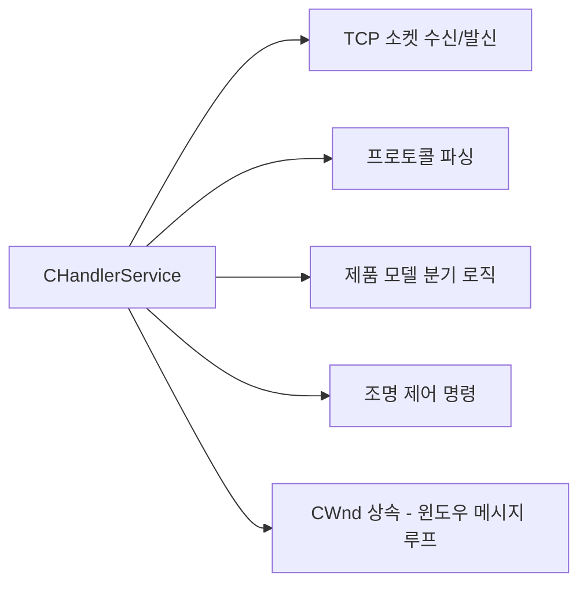

# SOLID 원칙 위반 분석 — Universal_AVI (uScan)

> **분석 기준일:** 2026-03-06
> **대상 브랜치:** master (`3a2fc6a`)
> **분석 범위:** 핵심 서비스 계층 + FAI 모듈 + Handler 계층

---

## 1. 개요

uScan 프로젝트는 Windows MFC 기반의 전자부품 머신비전 검사 시스템이다.
수년간의 기능 추가로 인해 핵심 클래스들이 SOLID 원칙에서 상당히 이탈해 있다.
본 문서는 각 원칙별로 **구체적 파일·라인 증거**를 제시하고, 리팩터링 방향을 제안한다.

### 분석 대상 파일

| 파일 | 크기 | 주요 역할 |
|------|------|-----------|
| `Algorithm.h/cpp` | ~890KB | 검사 조율자 (God Object) |
| `AlgorithmThreadDefine.h` | 20,000+ 라인 | 스레드 구현 묶음 |
| `InspectService.h/cpp` | 대형 | 검사 흐름 + 이미지 저장 + 로그 |
| `HandlerService.h/cpp` | 대형 | TCP 핸들러 + 제품 분기 + 조명 |
| `ADJClientService.h/cpp` | 대형 | AI 서버 클라이언트 |
| `FAI/BOIFAIInspector.cpp` | 중형 | BOI 제품 FAI 검사 |
| `FAI/ACTFAIInspector.cpp` | 중형 | ACT 제품 FAI 검사 |

---

## 2. S — 단일 책임 원칙 (SRP) 위반

> **원칙:** 클래스는 변경될 이유가 하나뿐이어야 한다.

### 2-1. `Algorithm` 클래스 — God Object

**파일:** `Algorithm.h`, `Algorithm.cpp`

`Algorithm` 클래스는 다음 책임을 **모두** 단독으로 수행한다:

| 책임 영역 | 증거 |
|-----------|------|
| 이미지 버퍼 관리 | `m_HInspectCImage[buffer][vision][image][roi]` 4D 배열 |
| 스레드 동기화 | `CCriticalSection` + `CEvent` 객체 20개 이상 |
| Surface/Edge/Gap/Corner/OCR 알고리즘 | 알고리즘 메서드 30개 이상 |
| Barcode/FAI/Shape 알고리즘 | 동일 클래스 내 |
| ADJ 이미지 저장 | 저장 큐 + 저장 스레드 포함 |
| 글로벌 얼라인 | GlobalMatching 관련 로직 포함 |
| FAI Inspector 생성 | `Algorithm.cpp:44–51` 직접 `new BOIFAIInspector(this)` |

```cpp
// Algorithm.cpp:44-51 — FAI Inspector 생성 책임까지 Algorithm이 담당
#if defined(UAVI_BOI)
    m_pFAIInspector = new BOIFAIInspector(this);
#elif defined(UAVI_ACT)
    m_pFAIInspector = new ACTFAIInspector(this);
#else
    m_pFAIInspector = nullptr;
#endif
```

**영향:** 파일 크기 ~890KB, 멤버 함수 95개. 어떤 알고리즘을 수정해도 이 파일을 건드려야 한다.

---

### 2-2. `CInspectService` — 이미지 저장 + 검사 흐름 + 로그

**파일:** `InspectService.h/cpp`

| 책임 영역 | 구현 형태 |
|-----------|-----------|
| Raw 이미지 저장 | 전용 큐 + 저장 스레드 |
| Result 이미지 저장 | 전용 큐 + 저장 스레드 |
| Review 이미지 저장 | 전용 큐 + 저장 스레드 |
| ADJ 이미지 저장 | 전용 큐 + 저장 스레드 |
| FAI 이미지 저장 | 전용 큐 + 저장 스레드 |
| 로트(Lot) 관리 | 로트 시작/종료 흐름 |
| 오토포커스 스레드 | AutoFocus 로직 내장 |
| 배치 그랩 연동 | BatchGrab 의존 포함 |

```cpp
// InspectService.cpp:6247 — 새 로그 타입마다 이 switch를 수정해야 함
switch (iSaveLogType) {
    case LOG_TYPE_INSPECT: ...
    case LOG_TYPE_FAI:     ...
    case LOG_TYPE_ADJ:     ...
    // 새 타입 추가 = CInspectService 수정
}
```

**영향:** 5종류의 저장 경로가 한 클래스 안에서 경합하며, 저장 정책 변경이 검사 흐름 코드에 영향을 준다.

---

### 2-3. `CHandlerService` — TCP 파싱 + 제품 분기 + 조명 제어

**파일:** `HandlerService.h/cpp`



TCP 통신 계층, 비즈니스 분기 계층, 하드웨어 제어 계층이 하나의 클래스에 혼재한다.

---

### 2-4. `AlgorithmThreadDefine.h` — 단일 파일 스레드 묶음

**파일:** `AlgorithmThreadDefine.h` (20,000+ 라인)

다음 스레드 함수들의 **전체 구현**이 헤더 한 파일에 인라인 정의되어 있다:

- `SaveImageThread`
- `ResultSaveThread_N1` ~ `ResultSaveThread_N4`
- `InspectThreadAlgorithm`

헤더 파일에 구현을 넣는 것 자체가 컴파일 단위 격리를 불가능하게 하여 빌드 시간을 증가시키고, 각 스레드 로직을 독립적으로 유지보수할 수 없게 만든다.

---

## 3. O — 개방-폐쇄 원칙 (OCP) 위반

> **원칙:** 확장에는 열려 있고, 수정에는 닫혀 있어야 한다.

### 3-1. FAI Inspector 생성 — `#if defined(UAVI_*)` 분기

**파일:** `Algorithm.cpp:44–51`

```cpp
#if defined(UAVI_BOI)
    m_pFAIInspector = new BOIFAIInspector(this);
#elif defined(UAVI_ACT)
    m_pFAIInspector = new ACTFAIInspector(this);
#else
    m_pFAIInspector = nullptr;    // AKC: 아직 미구현
#endif
```

새 제품(예: `UAVI_CHS_KS`)을 추가하려면 `Algorithm.cpp`를 **직접 수정**해야 한다. 전략 패턴(Strategy) + 팩토리(Factory)가 있음에도 생성 지점이 닫혀 있지 않다.

---

### 3-2. `CHandlerService` 제품 모델 분기 — 16곳 산재

**파일:** `HandlerService.cpp`

```cpp
// 예시 — 동일 패턴이 HandlerService.cpp 전체에 16회 반복
if (strEquipModel == "BOI" || strEquipModel == "BOS") {
    // BOI 전용 처리
} else if (strEquipModel == "ACT") {
    // ACT 전용 처리
}
```

새 모델 추가 시 **16곳**을 모두 찾아 수정해야 한다. 누락 시 런타임 버그가 발생하며, 코드 리뷰로 검출하기 어렵다.

---

### 3-3. 전역 제품 매크로 — 14개 파일에 47회 분산

프리프로세서 매크로 `#if defined(UAVI_BOI)` 등의 분포:

| 파일 | 빈도 |
|------|------|
| `uScan.cpp` | 9회 |
| `InspectAdminViewDlg.cpp` | 16회 |
| `Algorithm.cpp` | 다수 |
| 기타 11개 파일 | 합계 22회 |
| **합계** | **47회** |

매크로 기반 제품 분기는 빌드 타임에만 검증되며, 런타임 다형성(polymorphism)을 활용하지 못한다. 제품 추가/제거마다 14개 파일을 수정해야 한다.

---

## 4. L — 리스코프 치환 원칙 (LSP) 위반

> **원칙:** 파생 클래스는 기반 클래스를 완전히 대체할 수 있어야 한다.

### 4-1. 서비스 클래스의 `CWnd` 상속

**파일:** `ADJClientService.h:797`, `HandlerService.h:17`

```cpp
// ADJClientService.h:797
class CADJClientService : public CWnd { ... };

// HandlerService.h:17
class CHandlerService : public CWnd { ... };
```

`CWnd`는 윈도우 UI 위젯의 기반 클래스다. AI 서버 클라이언트와 TCP 핸들러가 이를 상속하면:

- `CWnd`의 `Create()`, `ShowWindow()`, `DestroyWindow()` 같은 윈도우 API가 서비스 클래스에 노출된다.
- 서비스 클래스를 `CWnd*`로 다루면 윈도우 생명주기 가정이 무너진다.
- 실제 사용 목적(`PostMessage`/`SendMessage`를 통한 스레드 간 통신)은 `CWnd` 상속 없이도 달성 가능하다.

**올바른 대안:** 별도 `CWnd` 멤버를 두거나 `PostThreadMessage`를 직접 사용한다.

---

### 4-2. `IFAIInspector` AKC Stub 구현

**파일:** `Algorithm.cpp:22133` 근처, `Algorithm.cpp:50`

```cpp
// Algorithm.cpp:50 — AKC 빌드 시 nullptr
#else
    m_pFAIInspector = nullptr;
```

```cpp
// Algorithm.cpp:22133 근처 — InspectFAI() AKC 구현 stub
// "AKC 버전은 아직 Strategy 패턴으로 전환 중"
```

`IFAIInspector` 인터페이스의 계약(`Inspect()` 호출 시 정상 검사 수행)을 AKC 빌드에서 이행하지 않는다. `nullptr`을 반환하면 호출 지점에서 별도 nullptr 검사가 필요하고, 이는 인터페이스 추상화의 이점을 소멸시킨다.

---

## 5. I — 인터페이스 분리 원칙 (ISP) 위반

> **원칙:** 클라이언트는 사용하지 않는 메서드에 의존하도록 강제되어서는 안 된다.

### 5-1. FAI Inspector에 `Algorithm*` 전체 주입

**파일:** `FAI/BOIFAIInspector.cpp`, `FAI/ACTFAIInspector.cpp`

```cpp
// BOIFAIInspector 생성자 — Algorithm의 95개 메서드 전체에 접근 가능
BOIFAIInspector::BOIFAIInspector(Algorithm* pAlgorithm)
    : m_pAlgorithm(pAlgorithm) { ... }
```

FAI Inspector가 실제로 사용하는 것:

| 실제 사용 항목 | `Algorithm` 전체 크기 대비 |
|----------------|---------------------------|
| `GetPixelSize()` | 1/95 |
| `m_StructFaiMeasure[...]` | 데이터 필드 일부 |
| `m_nMzNo[...]` | 데이터 필드 일부 |

95개 메서드 중 극소수만 필요하지만 `Algorithm*` 전체가 주입된다. FAI Inspector는 알고리즘의 Surface/OCR/Barcode 메서드와 무관하게 결합된다.

---

### 5-2. `CWnd` 불필요 메서드 상속

`CHandlerService : public CWnd` 패턴(4-1 참조)은 ISP 위반이기도 하다.

TCP 소켓 핸들러가 `CWnd`의 윈도우 관련 수백 개 메서드를 "상속받아 노출"하지만, 실제로는 `PostMessage`/스레드 통신에만 사용한다.

---

## 6. D — 의존성 역전 원칙 (DIP) 위반

> **원칙:** 고수준 모듈은 저수준 모듈에 의존해서는 안 된다. 둘 다 추상화에 의존해야 한다.

### 6-1. `THEAPP` 전역 직접 참조

**파일:** `FAI/BOIFAIInspector.cpp`, `FAI/ACTFAIInspector.cpp`, `InspectService.cpp`

```cpp
// BOIFAIInspector.cpp — 고수준 FAI 정책이 전역 구체 인스턴스에 직접 의존
THEAPP.m_pCalDataService_N[nCamIdx]->GetPixelSize();
THEAPP.m_pModelDataManager->m_dMMultipleStg2Fai;
THEAPP.m_StructFaiMeasure[nMzNo];

// InspectService.cpp — 검사 서비스가 전역 설정 구조체 직접 참조
THEAPP.Struct_PreferenceStruct.nSomeOption;
```

`THEAPP`(전역 `CuScanApp` 인스턴스) 직접 접근은:
- 단위 테스트 불가 (테스트 더블 주입 불가)
- 의존 관계가 헤더에 드러나지 않아 추적 어려움
- 앱 전역 상태 변경이 FAI 로직에 즉시 파급

---

### 6-2. 구체 FAI 클래스 직접 생성

**파일:** `Algorithm.cpp:44–51` (3-1과 동일 코드)

```cpp
// Algorithm.cpp:44–51
// 고수준 조율자 Algorithm이 구체 구현체를 직접 생성
m_pFAIInspector = new BOIFAIInspector(this);
```

`IFAIInspector` 인터페이스가 존재함에도, `Algorithm`이 구체 클래스를 직접 `new` 한다.
추상 팩토리나 DI 컨테이너를 사용하면 `Algorithm`이 `IFAIInspector`만 알아도 된다.

---

## 7. 위반 종합 히트맵

```
파일/클래스                          S    O    L    I    D
─────────────────────────────────────────────────────────
Algorithm.h/cpp                     ██   ██        ██   ██
AlgorithmThreadDefine.h             ██
CInspectService                     ██   ██
CHandlerService                     ██   ██   ██   ██
CADJClientService                             ██   ██
FAI/BOIFAIInspector                      ██        ██   ██
FAI/ACTFAIInspector                      ██        ██   ██
IFAIInspector (AKC)                           ██
uScan.cpp                                ██
InspectAdminViewDlg.cpp                  ██

██ = 위반 확인됨
```

### 위반 빈도 요약

| 원칙 | 위반 건수 | 심각도 |
|------|-----------|--------|
| SRP | 4 | 높음 — God Object 존재, 파일 크기 임계치 초과 |
| OCP | 3 | 높음 — 14개 파일 47회 매크로, 16곳 if 분기 |
| LSP | 2 | 중간 — CWnd 상속 오용, stub 인터페이스 |
| ISP | 2 | 중간 — 뚱뚱한 Algorithm* 의존성 |
| DIP | 2 | 높음 — THEAPP 전역 직접 참조로 테스트 불가 |

---

## 8. 리팩터링 로드맵

### 단기 (위험도 낮음)

1. **`AlgorithmThreadDefine.h` 분할**
   인라인 스레드 구현을 `SaveImageThread.cpp`, `InspectThread.cpp` 등 독립 `.cpp`로 분리.
   헤더는 함수 선언만 유지.

2. **`CHandlerService` 제품 분기 집중화**
   16곳의 `if (strEquipModel == "BOI")` 패턴을 `ProductStrategy` 인터페이스로 교체.
   Handler는 전략 객체에 위임만 수행.

3. **`IFAIInspector` AKC 구현 완성 또는 Null Object 패턴 적용**
   `nullptr` 대신 `NullFAIInspector` (아무것도 하지 않는 구현체)를 반환.
   호출 지점의 `if (m_pFAIInspector != nullptr)` 검사 제거.

### 중기 (구조 변경)

4. **FAI Inspector 의존성 주입 인터페이스화**
   `Algorithm*` 대신 `IFAIContext` 인터페이스 도입:
   ```cpp
   class IFAIContext {
   public:
       virtual double GetPixelSize(int camIdx) const = 0;
       virtual const FaiMeasureStruct& GetFaiMeasure(int mzNo) const = 0;
       virtual int GetMzNo(int idx) const = 0;
   };
   ```
   FAI Inspector는 `IFAIContext*`만 주입받는다.

5. **`CInspectService` 저장 책임 분리**
   각 저장 타입을 `IRawImageSaver`, `IResultImageSaver` 등 독립 인터페이스로 분리.
   `CInspectService`는 이들을 조합하는 조율자로만 남긴다.

6. **FAI Inspector 팩토리 도입**
   ```cpp
   // Algorithm.cpp:44-51 대체
   m_pFAIInspector = FAIInspectorFactory::Create(productType, context);
   ```
   `Algorithm.cpp`에서 `#if defined(UAVI_*)` 제거.

### 장기 (아키텍처 개선)

7. **`THEAPP` 전역 의존 제거**
   FAI Inspector, InspectService에 필요한 데이터를 생성 시점에 주입.
   `CalDataService`, `ModelDataManager`를 생성자 파라미터로 전달.

8. **`CWnd` 상속 대체**
   `CADJClientService`, `CHandlerService`에서 `CWnd` 상속 제거.
   내부에 `CWnd` 멤버 변수를 두거나, 스레드 간 통신을 `PostThreadMessage` / 콜백으로 대체.

9. **`Algorithm` 분해 (대형 과제)**
   최소 다음 3개 클래스로 분리:
   - `AlgorithmBufferManager` — 이미지 버퍼 + 동기화
   - `AlgorithmRunner` — 알고리즘 실행 파이프라인
   - `AlgorithmCoordinator` — 결과 집계 + 저장 위임

---

## 참고: 관련 분석 문서

| 문서 | 내용 |
|------|------|
| [`Memory_Leak_Analysis.md`](Memory_Leak_Analysis.md) | 메모리 누수 패턴 분석 |
| [`SIMD_Optimization_Analysis.md`](SIMD_Optimization_Analysis.md) | SIMD 최적화 기회 분석 |
| [`UAVI_Flow_Analysis.md`](UAVI_Flow_Analysis.md) | 전체 검사 흐름 분석 |
| [`UI_Architecture.md`](UI_Architecture.md) | UI 계층 구조 분석 |
