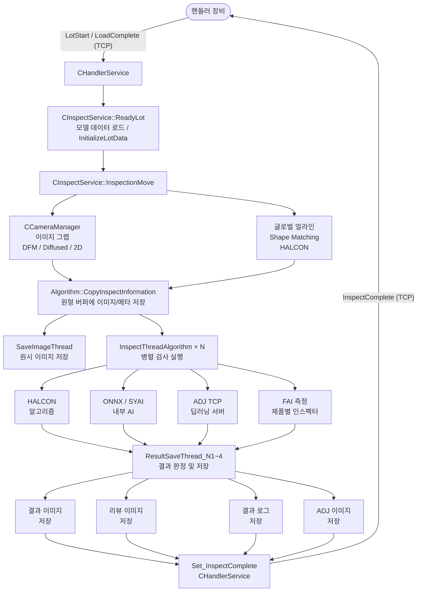

# Universal_AVI (uScan) 전체 SW Flow 분석

> 작성일: 2026-03-06

---

## 1. 전체 흐름 개요

```
[앱 시작] → [초기화] → [핸들러 연결] → [Lot Start]
  → [모델 로드] → [트레이 로딩 얼라인]
  → [모듈 로드 완료 수신] → [검사 이동]
  → [이미지 그랩] → [이미지 버퍼 복사]
  → [검사 스레드 (병렬)] → [결과 저장 스레드]
  → [검사 완료 전송] → [Lot End] → [결과 로그 저장]
```

외부 시스템과의 인터페이스:
- **핸들러 장비** ↔ `CHandlerService` (TCP/IP)
- **ADJ 딥러닝 서버** ↔ `CADJClientService` (TCP/IP)
- **LAS 서버** ↔ 네트워크 드라이브 마운트
- **SYAI 런타임** ↔ `syai_service::ServiceDirector` (in-process)

---

## 2. 애플리케이션 시작 및 초기화

### 2.1 InitInstance (CuScanApp)

```
CuScanApp::InitInstance()
  ├── MFC Document/View 초기화
  │     CuScanDoc, CuScanView, CMainFrame 생성
  ├── 전역 서비스 인스턴스 생성
  │     Algorithm::GetInstance()          — 검사 엔진 (비전채널별)
  │     CInspectService::GetInstance()    — 검사 흐름 오케스트레이션
  │     CHandlerService::GetInstance()    — 핸들러 TCP 통신
  │     CCameraManager                    — 카메라 하드웨어
  │     CBatchManager::GetInstance()      — 배치 검사 컨텍스트
  │     CADJClientService                 — 딥러닝 외부 서버 통신
  ├── 모델 데이터 로드
  │     ModelDataManager, InspectLibraryDataManager, LightLibraryDataManager
  ├── UI 다이얼로그 생성
  │     CInspectAdminViewDlg, CTabControlDlg, CInspectResultDlg, CTrayAdminViewDlg1~4 등
  ├── 카메라/조명 하드웨어 초기화
  │     CCameraManager::Initialize()
  ├── 핸들러 TCP 연결
  │     CHandlerService::Initialize_Handler()
  └── 타이머 및 상태 폴링 시작
```

### 2.2 서비스 초기화 상세

| 서비스 | 초기화 내용 |
|--------|------------|
| `Algorithm` | 검사 버퍼 초기화, 세마포어 생성, FAI 인스펙터 팩토리 호출 |
| `CInspectService` | 이미지 저장 큐/스레드 초기화, Lot 데이터 리셋 |
| `CHandlerService` | TCP 소켓 연결, 조명 컨트롤러 TCP 연결 |
| `CADJClientService` | 딥러닝 서버 연결, ADJ 상태 초기화 |
| `syai_service::ServiceDirector` | ONNX/SYAI 런타임 초기화, 스레드풀 및 워치독 타이머 구성 |

---

## 3. 핸들러 통신 프로토콜 흐름

`CHandlerService`는 TCP 소켓을 통해 핸들러 장비와 명령/응답을 교환한다.

### 3.1 Lot 시작 시퀀스

```
핸들러(장비)                    CHandlerService
    │──── LotStart 명령 ───────────→│
    │                              │ Get_LotStart(LotID, MzNo, TrayAmt, ModuleAmt, ...)
    │                              │   → CInspectService::ReadyLot()  [모델 자동 로드]
    │                              │   → Set_LotReady(LotID, MzNo)  [Ready 응답]
    │←─── LotReady 응답 ───────────│
    │
    │──── TrayLoaded 명령 ──────────→│
    │                              │ Get_TrayLoaded(LotID, MzNo, TrayNo)
    │
    │──── LoadComplete 명령 ────────→│
    │                              │ Get_LoadComplete(VisionType, JigNo, LotID, MzNo, TrayNo, ModuleNo, ...)
    │                              │   → CInspectService::InspectionMove()  [검사 시작]
    │←─── LoadReply 응답 ───────────│
```

### 3.2 검사 중 시퀀스

```
핸들러(장비)                    CHandlerService / CInspectService
    │←─── ScanComplete 전송 ────────│ Set_ScanComplete(LotID, MzNo, JigNo, TrayNo, ModuleNo, VisionType)
    │                              │  (이미지 그랩 완료 후)
    │
    │←─── InspectComplete 전송 ─────│ Set_InspectComplete(LotID, MzNo, TrayNo, ModuleNo, VisionType,
    │                              │                      ModuleResult, DefectCode)
    │                              │  (검사 및 결과 저장 완료 후)
    │
    │──── HistoryUpdate 명령 ───────→│ Get_HistoryUpdate(...)  [분류 결과 업데이트]
    │
    │──── LotEnd 명령 ──────────────→│ Get_LotEnd(LotID, MzNo)
    │                              │   → CInspectService::SaveResultLog()
    │←─── LotReply 응답 ────────────│
```

### 3.3 핸들러 명령 타입

| 방향 | 명령 | 설명 |
|------|------|------|
| 수신(Get_) | `LotStart` | Lot 시작, 모델 로드 트리거 |
| 수신(Get_) | `LoadComplete` | 모듈 로딩 완료, 검사 시작 |
| 수신(Get_) | `TrayLoaded` | 트레이 장착 완료 |
| 수신(Get_) | `BarcodeUpdate` | 바코드 수신 |
| 수신(Get_) | `MoveComplete` | 이동 완료 |
| 수신(Get_) | `LotEnd` | Lot 종료 |
| 수신(Get_) | `HistoryUpdate` | 분류 이력 업데이트 |
| 송신(Set_) | `ScanComplete` | 이미지 그랩 완료 |
| 송신(Set_) | `InspectComplete` | 검사 완료 + 결과 코드 |
| 송신(Set_) | `LotReady` | Lot 준비 완료 |
| 송신(Set_) | `BarcodeResult` | 바코드 인식 결과 |
| 송신(Set_) | `AlarmRequest` | 알람 발생 |
| 송신(Set_) | `ErrorRequest` | 에러 발생 |
| 송신(Set_) | `TrayComplete` | 트레이 검사 완료 |

---

## 4. 검사 메인 루프 (InspectionMove)

`CInspectService::InspectionMove()`는 한 모듈의 검사 사이클을 담당한다.

```
CInspectService::InspectionMove(iVisionType, iMzNo)
  │
  ├─ [1] 자동포커스 수행 (옵션)
  │       AutoFocus → 카메라 Z축 이동
  │
  ├─ [2] 이미지 그랩
  │       CCameraManager::GrabImage()
  │       ├── 표준 2D: MIL 원형 버퍼 (GRAB_CIRCULAR_MAX) 사용
  │       ├── Specular (DFM): DFMStartGrab() → DFMProc()
  │       │     CUDA 기반 위상 측정 (S_Universal_AVI DLL)
  │       └── Diffused: DiffusedProc()
  │             CUDA 기반 확산광 처리
  │
  ├─ [3] 글로벌 얼라인 (Shape Matching)
  │       Algorithm::ImageAlignShapeMatching()
  │       → HALCON shape_model 기반 위치 보정
  │       → HomMat (호모그래피 행렬) 계산 → 이미지 아핀 변환
  │
  ├─ [4] 검사 버퍼에 이미지 복사
  │       Algorithm::CopyInspectInformation()
  │       ├── m_HInspectCImage[bufferIdx][channel][imageNo]  에 복사
  │       ├── 검사 메타정보 기록 (LotID, MzNo, TrayNo, ModuleNo, ...)
  │       └── 버퍼 상태를 InspectDone=FALSE 로 설정
  │
  ├─ [5] ScanComplete 전송
  │       CHandlerService::Set_ScanComplete()
  │
  ├─ [6] 원시 이미지 저장 (비동기 스레드)
  │       AfxBeginThread(SaveImageThread)   — 원시 이미지 파일 저장
  │       AfxBeginThread(SaveRawImageThread_Cam)  — 카메라별 원시 이미지
  │       BarcodeTransferThread — 바코드 이미지 전송
  │
  ├─ [7] 검사 스레드 큐에 추가
  │       Algorithm::AddListInspectThreadParam()
  │       → Semaphore 해제 → InspectThreadAlgorithm 스레드 활성화
  │
  └─ [8] 결과 저장 스레드 큐에 추가
          Algorithm::AddListScanThreadParam()
          → ResultSaveThread_N1~N4 대기 루프 진입
```

---

## 5. 검사 스레드 (InspectThreadAlgorithm)

검사 스레드는 비전 채널당 `NO_MAX_INSPECT_THREAD` 개 병렬로 실행된다.

```
InspectThreadAlgorithm(THREAD_PARAM{threadIdx, visionCamIdx})
  │
  ├── Semaphore 대기 (CSingleLock)
  ├── 큐에서 INSPECT_THREAD_PARAM 꺼냄
  │     → bufferIdx = pInspectThreadParam->iInspectionBufferIdx
  │
  ├── [전처리] 글로벌 얼라인 적용 (AffineTransform)
  │
  ├── [ROI 루프] 모든 InspectionType × ROI 순회
  │     GTRegion 목록 순회
  │     │
  │     ├── ApplyLocalAlignResult()   — 로컬 얼라인
  │     ├── ApplyDontCareResult()     — DontCare 마스킹
  │     ├── ApplyMaskResult()         — 마스크 적용
  │     │
  │     └── InspectAVI()             — 메인 검사 알고리즘
  │           └── 알고리즘 타입에 따라 분기
  │                 SurfaceInspectionAlgorithm()   표면 검사
  │                 EdgeMeasureAlgorithm()          엣지 측정
  │                 DistanceMeasureAlgorithm()      거리 측정
  │                 GapMeasureAlgorithm()           갭 측정
  │                 BarcodeAlgorithm()              바코드
  │                 OCR(HALCON)                     문자 인식
  │                 ROIAlignAlgorithm()             ROI 로컬 얼라인
  │                 ComponentAlgorithm()            부품 검사
  │                 ImageCompareAlgorithm()         이미지 비교
  │                 FAI 측정 알고리즘               (IFAIInspector)
  │                 ... (총 30+ 알고리즘 타입)
  │
  ├── [AI 검사] ADJ 딥러닝 서버 전송 (옵션)
  │     CADJClientService::DoDeeplearningInspection()
  │     → 결함 영역 이미지를 TCP 패킷으로 외부 ADJ 서버 전송
  │     → 응답 대기 (INSPECT REPLY)
  │     → AI 결과 반영
  │
  ├── [SYAI 검사] 내부 AI 런타임 (옵션)
  │     syai_service::ServiceDirector 에 작업 큐잉
  │     → ONNX Runtime / syai_runtime_inspection
  │     → WatchdogTimer 로 타임아웃 감시
  │
  ├── [FAI 검사] 제품별 FAI 인스펙터 실행
  │     IFAIInspector::Inspect()  (전략 패턴)
  │     ├── AKCFAIInspector  / BOIFAIInspector
  │     ├── ACTFAIInspector  / ATWFAIInspector
  │     └── CHSFAIInspector (KS/WZ 변형)
  │     → CFAIDataManager에 측정값 저장
  │
  ├── 검사 결과를 버퍼에 기록
  │     m_HDefectRgn_DefectName[bufIdx][inspType][defectName]
  │     m_HDefectRgn_InspectionType[bufIdx][inspType]
  │     m_HMeasureRgn_FAI_Item[bufIdx][faiItem][param]
  │
  └── 버퍼 상태 변경: InspectDone = TRUE
        Algorithm::ChangeInspectDone(bufferIdx, DONE)
        → ResultSaveThread 깨움
```

---

## 6. 결과 저장 스레드 (ResultSaveThread_N1~N4)

비전 채널 1~4 각각에 대해 독립 스레드가 실행된다. `IsInspectDone()` 폴링으로 검사 완료를 감지한다.

```
ResultSaveThread_N{1|2|3|4}(Algorithm* pAlgorithm)
  │
  ├── 루프: ScanThreadParam 큐가 빌 때까지 반복
  │
  ├── [대기] IsInspectDone(bufferIdx) == TRUE 될 때까지 Sleep(50ms)
  │
  ├── [결과 판정]
  │     결함 우선순위(DefectPriority) 적용
  │     최종 판정: GOOD("G") / NG("N") + 결함 코드
  │     FAI 결과 코드 생성
  │
  ├── [1] 결과 이미지 저장 (CInspectService 비동기 큐)
  │     WriteResultFile() — HideDlg에서 HALCON 렌더링 후 PNG/BMP 저장
  │     AddListSaveResultImageParam() → 결과 이미지 저장 스레드
  │
  ├── [2] 리뷰 이미지 저장 (비동기)
  │     WriteSelectedRosReviewFile() — 결함 중심 크롭 이미지
  │     WriteSelectedRosReviewFile_FAI() — FAI 리뷰 이미지
  │     AddListSaveReviewImageParam() → 리뷰 이미지 저장 스레드
  │
  ├── [3] ADJ 이미지 저장 (비동기)
  │     AddListSaveADJImageParam() → ADJ 이미지 저장 스레드
  │
  ├── [4] FAI 이미지 저장 (비동기)
  │     AddListSaveFAIImageParam() → FAI 이미지 저장 스레드
  │
  ├── [5] 결과 로그 저장 (비동기 큐)
  │     INI 형식 결과 파일 (Local / LAS 서버)
  │     AddListSaveResultLogParam() → 결과 로그 저장 스레드
  │     ├── 바코드 ID
  │     ├── 결함 코드/타입
  │     ├── FAI 측정값 (제품별 형식)
  │     └── 검사 소요 시간
  │
  ├── [6] InspectComplete 전송
  │     CHandlerService::Set_InspectComplete(LotID, MzNo, TrayNo, ModuleNo,
  │                                           VisionType, ModuleResult, DefectCode)
  │
  ├── [7] 화면 업데이트
  │     CInspectAdminViewDlg::UpdateView()
  │     CTrayAdminViewDlg::UpdateTrayDisplay()
  │     CInspectResultDlg 상태 갱신
  │
  └── [8] 버퍼 해제: ChangeInspectDone(bufIdx, IDLE)
```

---

## 7. 이미지 저장 파이프라인

이미지 저장은 모두 별도 스레드에서 비동기로 처리하며, `CInspectService` 의 `deque` 큐를 통해 생산자-소비자 패턴으로 동작한다.

```
                   ResultSaveThread (생산자)
                         │
       ┌─────────────────┼──────────────────────┐
       ↓                 ↓                      ↓
  Raw Image          Result Image          Review Image
  저장 큐              저장 큐               저장 큐
  (deque)             (deque)               (deque)
       │                 │                      │
  AfxBeginThread     AfxBeginThread         AfxBeginThread
  SaveImageThread    (Result저장 스레드)    (Review저장 스레드)
       │                 │                      │
  Local/LAS          Local/LAS              Local/LAS
  폴더 저장          폴더 저장              폴더 저장
```

### 저장 경로 구조

```
[RawFolderPath]/   LotID/MzNo/TrayNo/ModuleNo/VisionType/
                   ├── Raw_*.jpg           원시 이미지
                   └── Result_*.jpg        결과 이미지 (결함 영역 오버레이)

[ReviewFolderPath]/ LotID/MzNo/TrayNo/ModuleNo/
                   └── Review_*.jpg        결함 중심 크롭 리뷰

[AdjFolderPath]/   ...                     ADJ 서버 전송용 이미지

[FAIFolderPath]/   ...                     FAI 측정 이미지

[ResultLogPath]/   LotID/
                   └── *.ini / *.csv       검사 결과 로그
```

---

## 8. 배치 검사 흐름 (BatchInspection)

배치 검사는 하나의 모듈을 여러 스테이지 이동으로 나눠 그랩하는 경우에 사용된다.

```
CBatchManager::SplitBatches_AxisMove(MzNo, TrayNo, ModuleNo, PcVisionNo, StageNo, ImageCount)
  → BATCH_INFO 배열 생성 (각 배치: 이미지 범위, 축 좌표, 상태)

배치 그랩 루프:
  BATCH_STATUS_IDLE → BATCH_STATUS_GRAB_START
    │ BatchGrabThread (이미지 획득)
    ↓
  BATCH_STATUS_GRAB_END
    │ CopyInspectInformation_Batch() — 배치 이미지를 검사 버퍼에 복사
    ↓
  BATCH_STATUS_INSPECT_START
    │ InspectThreadAlgorithm (배치 단위 검사)
    ↓
  BATCH_STATUS_INSPECT_COMPLETE

  IsLastBatch() == TRUE 이면 → ResultSaveThread 진입
```

---

## 9. ADJ 딥러닝 검사 흐름

`CADJClientService`는 비전 검사에서 결함이 발견된 이미지를 외부 딥러닝 서버로 전송하고 재분류 결과를 수신한다.

```
InspectThreadAlgorithm
  └── DoDeeplearningInspection(threadNo, bufIdx, visionCamType, defectRgn, ...)
        │
        ├── AssignDeepLearningModel()   — 모델 번호 결정
        ├── 이미지 전처리 (ROI 크롭, OpenCV Mat 변환)
        │     RoiImagePreprocessing()
        ├── TCP 패킷 생성 (stTCPPacket)
        │     Command: "INSPECT REQUEST"
        │     이미지 데이터 (Width × Height × 3 bytes)
        │
        ├── m_qADJBuffer[moduleNo].push(stADJNetworkData*)
        │
        └── ADJ_Network_Thread (별도 스레드)
              CTCPClient::SendData()   — 외부 서버로 전송
              응답 대기 (INSPECT REPLY)
              ├── byteDeepLearningResult 파싱
              └── AI 결과를 최종 결함 코드에 반영

FAI ADJ:
  DoDeeplearningRosReviewFile_FAI()
  → FAI 이미지 전송 (Command: "INSPECTFAI REQUEST")
  → m_qFAIADJBuffer에 큐잉 → FAI_ADJ_Network_Thread
```

---

## 10. SYAI (내부 AI) 검사 흐름

```
syai_service::ServiceDirector
  ├── AIService::ThreadPool — 병렬 AI 추론 스레드
  ├── AIService::WatchdogTimer — 타임아웃 감시
  │
  ├── 작업 큐잉: director.Enqueue(jobParam)
  │
  └── ONNX Runtime 추론
        onnxruntime::InferenceSession
        → CUDA EP (GPU 가속) 또는 CPU EP
        → syai_runtime_inspection DLL
        → 결과: 결함 영역 마스크 / 분류 결과
```

---

## 11. FAI 검사 흐름 (전략 패턴)

```
FAIInspectorFactory::Create(modelType)
  └── IFAIInspector* (제품별 구현체 반환)

        AKCFAIInspector::Inspect()
        BOIFAIInspector::Inspect()
        ACTFAIInspector::Inspect()
        ATWFAIInspector::Inspect()
        CHSFAIInspector(KS/WZ)::Inspect()
          │
          ├── ROI별 측정 알고리즘 수행
          │     (엣지, 거리, 높이, 갭, 코너 등)
          ├── CenterlineMeasureStruct에 측정값 기록
          │     CFAIDataManager::GetInstance().GetMeasure(Mz, Tray, Module, ...)
          └── 합불 판정 (측정값 vs 스펙 한계)
                m_HMeasureRgn_FAI_Item[bufIdx][faiItem][param]
                m_HDefectRgn_FAI[bufIdx]
```

---

## 12. 티칭 모드 흐름

티칭 모드는 운영자가 UI를 통해 직접 모델 파라미터를 설정하는 흐름이다.

```
CuScanView → [티칭 V1~4 버튼 클릭]
  └── CTabControlDlg::Show()
        │
        ├── CLightControlDlg  — 조명값 조정 및 그랩 테스트
        │     ├── GrabCamera_SwTrg()  — 수동 트리거 그랩
        │     └── CInspectAdminViewDlg::UpdateView()  — 라이브 이미지 표시
        │
        ├── CTeachParamDlg  — ROI 파라미터 탭
        │     └── ROI 선택 시 → CTeachingAlgorithmTabDlg::SetSelectedInspection()
        │
        └── CTeachingAlgorithmTabDlg  — 알고리즘 파라미터
              ├── SetParam() / GetParam()  — 파라미터 R/W
              ├── [테스트 버튼]
              │     InspectionTest(enableVision=true, enableAi=false)
              │     → 현재 ROI 기준으로 알고리즘 단독 실행
              │     → 결과를 CInspectAdminViewDlg 오버레이 표시
              └── [저장 후 닫기]
                    ModelDataManager::Save()  — 파라미터 파일 저장
```

---

## 13. 스레드 목록 및 동기화

| 스레드 | 기능 | 동기화 |
|--------|------|--------|
| `InspectThreadAlgorithm` × N | 검사 알고리즘 실행 | `CSemaphore`, `CCriticalSection` |
| `ResultSaveThread_N1~N4` | 결과 저장 오케스트레이션 | `CCriticalSection` + `Sleep(50ms)` 폴링 |
| `SaveImageThread` | 원시 이미지 파일 저장 | `CEvent m_evCopyForSavingDone` |
| `SaveRawImageThread_Cam` | 카메라별 원시 이미지 | `CCriticalSection m_csSaveRawImage_Cam` |
| `BarcodeTransferThread` | 바코드 이미지 전달 | 버퍼 인덱스 공유 |
| `ADJ_Network_Thread` × N | ADJ TCP 전송/수신 | `CSafeQueue m_qADJBuffer` |
| `FAI_ADJ_Network_Thread` × N | FAI ADJ TCP 전송 | `CSafeQueue m_qFAIADJBuffer` |
| `AIService::ThreadPool` workers | SYAI 내부 AI 추론 | 내부 큐 |
| `AIService::WatchdogTimer` | AI 타임아웃 감시 | 별도 타이머 스레드 |
| `AiSetupWaitThreadProc` | AI 설정 외부 프로세스 대기 | `HANDLE` 프로세스 핸들 |
| `CHandlerService`(CWnd 메시지) | TCP 명령 수신/처리 | WM 메시지 큐 |

### 핵심 동기화 객체

```
Algorithm 클래스:
  CCriticalSection  m_csInspectDone[INSPECTION_BUFFER_COUNT_MAX]
  int               m_iInspectBufferStatus[INSPECTION_BUFFER_COUNT_MAX]   — IDLE/DONE
  CCriticalSection  m_csAlgorithmThreadRunning[NO_MAX_INSPECT_THREAD]
  BOOL              m_bAlgorithmThreadRunning[NO_MAX_INSPECT_THREAD]
  CSemaphore*       m_pSemaphore                                          — 검사 스레드 제어
  CEvent            m_evCopyForSavingDone[NO_MAX_INSPECT_THREAD]          — 이미지 복사 완료

CInspectService 클래스:
  CCriticalSection  m_csScan                     — ScanParam 큐 보호
  CCriticalSection  m_csInspect                  — InspectParam 큐 보호
  CCriticalSection  m_csSaveRawImage             — Raw 이미지 큐 보호
  CCriticalSection  m_csSaveResultImage          — 결과 이미지 큐 보호
  CEvent            m_evAlignImageCopyDone        — 얼라인 이미지 복사 완료
```

---

## 14. 검사 버퍼 구조

```
Algorithm::m_HInspectCImage
  [INSPECTION_BUFFER_COUNT_MAX]   — 원형 버퍼 (동시 처리 슬롯)
  [CHANNEL_NUM]                   — 컬러/모노/채널별 이미지
  [MAX_IMAGE_TAB]                 — 이미지 탭 (조명별/위상별 이미지)

m_HDefectRgn_DefectName
  [INSPECTION_BUFFER_COUNT_MAX]
  [MAX_INSPECTION_TYPE]           — 검사 타입 (Surface, Edge, Gap, FAI, ...)
  [MAX_DEFECT_NAME]               — 결함 종류

m_HMeasureRgn_FAI_Item
  [INSPECTION_BUFFER_COUNT_MAX]
  [MAX_FAI_ITEM]                  — FAI 측정 항목
  [MAX_FAI_PARAMETER]             — 각 항목의 파라미터
```

---

## 15. 흐름 요약 다이어그램


